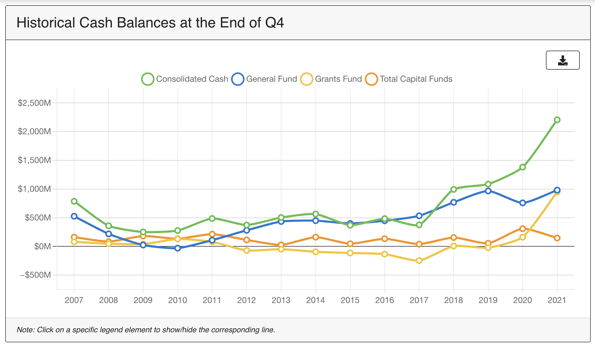
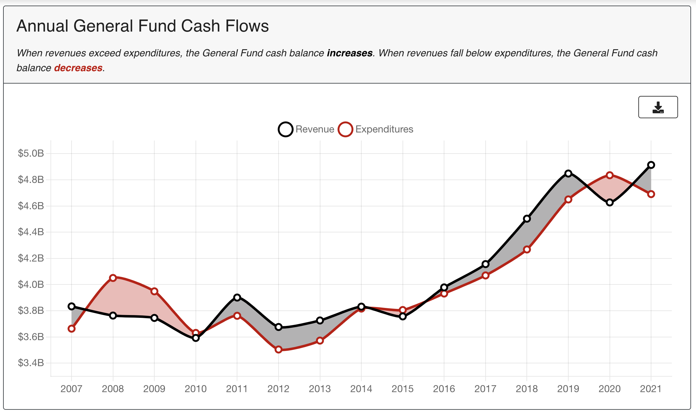

# Tracking the City of Philadelphia's Cash Balances

The code behind the interactive reports analyzing the City of Philadelphia's cash balances. 
These reports are produced quarterly using data from the Quarterly City Manager's Report. 

View the past cash reports:

- [FY22 Q3](https://controller.phila.gov/philadelphia-audits/cash-report-fiscal-year-2022-q3/)
- [FY22 Q2](https://controller.phila.gov/philadelphia-audits/cash-report-fiscal-year-2022-q2/)
- [FY22 Q1](https://controller.phila.gov/philadelphia-audits/cash-report-fiscal-year-2022-q1/)
- [FY21 Q4](https://controller.phila.gov/philadelphia-audits/cash-report-fiscal-year-2021/)
- [FY21 Q3](https://controller.phila.gov/philadelphia-audits/cash-report-fiscal-year-2021-q3/)
- [FY21 Q2](https://controller.phila.gov/philadelphia-audits/cash-report-fiscal-year-2021-q2/)
- [FY20 Q1](https://controller.phila.gov/philadelphia-audits/cash-report-fiscal-year-2021-q1/)
- [FY20 Q4](https://controller.phila.gov/philadelphia-audits/cash-report-fiscal-year-2020/)
- [FY20 Q3](https://controller.phila.gov/philadelphia-audits/cash-report-fiscal-year-2020-q3/)
- [FY20 Q2](https://controller.phila.gov/philadelphia-audits/cash-report-fiscal-year-2020-q2/)
- [FY19 Q1](https://controller.phila.gov/philadelphia-audits/cash-report-fiscal-year-2020-q1/)
- [FY19 Q4](https://controller.phila.gov/philadelphia-audits/cash-report-fiscal-year-2019/)
- [FY19 Q3](https://controller.phila.gov/philadelphia-audits/cash-report-fiscal-year-2019-q3/)
- [FY19 Q2](https://controller.phila.gov/philadelphia-audits/cash-report-fiscal-year-2019-q2/)
- [FY19 Q1](https://controller.phila.gov/philadelphia-audits/cash-report-fiscal-year-2019-q1/)
- [FY19 Q4](https://controller.phila.gov/philadelphia-audits/cash-report-fiscal-year-2018/)





## Tools

The application is built using a combination of open-source tools, including
[vue](https://github.com/vuejs/vue), [vuetify](https://github.com/vuetifyjs/vuetify), and [Chart.js](https://github.com/chartjs).


## Development

Clone this repository and then follow the 
instructions below to install.

### Project setup
```
yarn install
```
#### Compiles and hot-reloads for development
```
make serve fy=FISCAL_YEAR q=Q
```

where `FISCAL_YEAR` is the fiscal year and `Q` is the quarter that you wish to show.

#### Compiles and minifies for production
```
make build fy=FISCAL_YEAR q=Q
```
where `FISCAL_YEAR` is the fiscal year and `Q` is the quarter that you wish to show.


## Updating for a New Cash Report

To update for a new cash report, first follow the 
instructions above to install.

Then, follow these steps:

### 1. Update the `config.js` file

In [`config.js`](./src/config.js), update the `FISCAL_YEAR` and `QUARTER` variables to match the new fiscal year and quarter.

### 2. Create a new report folder

In the [`src/reports`](./src/reports) folder, create a folder for the new report. It usually makes sense to copy over the files from the previous year's
report from the same quarter, e.g., FY20 Q1 if you 
are updating for FY21 Q1. 

Then, edit the language for the report in the 
files to match the word document.